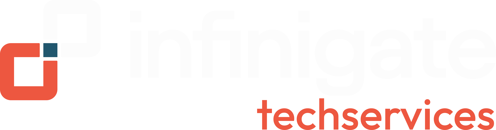

<div align="center">

# ProfMig

### Professional Windows Profile Migration Toolkit

**Powered by**



</div>

<div align="center">

[](https://github.com/scorpido74/ProfMig/releases)
[](https://github.com/scorpido74/ProfMig/actions)
[](https://github.com/scorpido74/ProfMig/issues)
[](LICENSE)

</div>

ProfMig is a PowerShell-based Windows profile migration toolkit designed to migrate user data and supported application data between Windows user profiles in a controlled, transparent and extensible way.

The project uses a modular architecture that separates profile discovery, validation, migration, application handling, exclusions, logging and reporting.

This architecture is intended to support interactive operation today while allowing future use through silent execution, automation, endpoint-management platforms and a graphical interface.

## Project status

**Current release stage:** M2 – Application Migration completed

The core migration and application migration frameworks are operational and have been validated using separate source and destination Windows user profiles.

ProfMig can currently:

- Discover Windows user profiles
- Select source and destination profiles
- Resolve Windows known folders for offline profiles
- Migrate standard Windows profile folders
- Prevent existing destination files from being overwritten
- Apply central migration and security exclusions
- Track copied, skipped, excluded and failed files
- Record migration statistics
- Generate structured migration results
- Generate human-readable migration reports
- Write operational logs
- Run through an interactive PowerShell menu
- Detect supported applications
- Migrate Microsoft Edge portable profile data
- Migrate Google Chrome portable profile data
- Migrate Microsoft Outlook portable data and settings
- Migrate application data through generic application definitions
- Perform pre-migration validation

Development continues with the validation, safety and reliability capabilities planned for **M3**.

## Current migration components

### Windows profile data

The Core Migration Engine currently supports migration of standard Windows user data including:

- Desktop
- Documents
- Downloads
- Pictures

Windows known folders are resolved against the selected source and destination profiles, including offline profiles.

### Microsoft Edge

ProfMig can detect Microsoft Edge profiles and migrate validated portable browser data.

Supported migration currently includes data such as:

- Bookmarks
- Bookmark backups
- Favicons

Security-sensitive and non-portable Edge data is excluded or held for review.

This includes data such as:

- Credentials
- Cookies
- Session state
- Session storage
- Authentication-related data

Additional portable Edge data remains subject to further validation.

### Google Chrome

ProfMig can detect and migrate multiple Google Chrome profiles.

Validated migration includes portable profile data while browser security exclusions prevent known sensitive or non-portable data from being transferred.

Examples of excluded data include:

- Credentials
- Authentication state
- Cookies where not considered portable
- Session data
- Account-specific state
- Other security-sensitive browser data

Existing destination Chrome data is protected from accidental overwrite.

### Microsoft Outlook

ProfMig supports detection of Classic Outlook and New Outlook installations and migrates validated portable Outlook data.

Supported portable data includes:

- PST files
- Signatures
- Outlook settings
- Print settings
- Office email templates

Non-portable or profile-dependent Outlook data is excluded or recreated.

Examples include:

- OST files
- Outlook account profiles
- Authentication state
- Send/Receive settings
- Profile-dependent cache data

Outlook authentication and account configuration must be re-established where required.

### Generic application migration

ProfMig includes a generic application migration framework.

Application definitions can describe:

- Application identity
- Detection rules
- Source and destination locations
- Include rules
- Exclude rules
- Validation rules

This allows additional applications to be supported without implementing a dedicated PowerShell migration module for every application.

## Architecture

ProfMig separates functionality into dedicated PowerShell modules.

```text
ProfMig
│
├── Configuration
├── Core Framework
├── Logging
├── Profile Inventory
├── Interactive Menu
├── Copy Engine
├── Reporting
├── Exclusion Engine
├── Application Detection
├── Generic Application Migration
├── Microsoft Edge Migration
├── Google Chrome Migration
├── Microsoft Outlook Migration
└── Migration Validation
```

The modules are intentionally separated so migration logic is not tied to a specific user interface.

### Copy Engine

The Copy Engine performs file migration and returns structured migration results.

It tracks:

- Files selected
- Files copied
- Files skipped
- Files excluded
- Files failed
- Bytes copied
- Component results
- Skipped items
- Excluded items
- Errors
- Migration status

Existing destination files are not overwritten.

### Exclusion Engine

ProfMig uses a central exclusion mechanism to prevent unsafe, unnecessary or non-portable data from being migrated.

Exclusions can be based on:

- File name
- Directory name
- Relative path
- File extension
- Application-specific rules

Security exclusions take precedence over generic migration rules.

Excluded source data is never deleted.

### Application Migration Framework

Application migration supports two provider models.

**Native providers** implement application-specific migration logic for applications requiring dedicated handling.

Current native providers include:

- Microsoft Edge
- Google Chrome
- Microsoft Outlook

**Generic providers** use application definition files to describe detection, migration and validation behavior.

This provides an extensible mechanism for adding support for additional applications.

### Validation Framework

ProfMig includes pre-migration validation capabilities designed to detect conditions that could make a migration unsafe or unreliable.

Validation capabilities are being expanded as part of M3.

### Reporting Engine

The Reporting Engine consumes structured results produced by the migration components.

Migration reports can contain:

- ProfMig version
- Source profile
- Destination profile
- Start time
- Completion time
- Duration
- Selected migration components
- File statistics
- Bytes copied
- Skipped items
- Excluded items
- Failed items
- Warnings
- Errors
- Overall migration result

Reports are stored in the configured `Reports` directory.

The underlying migration data remains structured for future GUI, automation and machine-readable reporting functionality.

## Project structure

```text
ProfMig/
│
├── src/
│   ├── ProfMig.ps1
│   ├── Config.psd1
│   │
│   ├── Applications/
│   │   └── *.psd1
│   │
│   └── Modules/
│       ├── ProfMig.Configuration.psm1
│       ├── ProfMig.Core.psm1
│       ├── ProfMig.Logging.psm1
│       ├── ProfMig.Inventory.psm1
│       ├── ProfMig.Menu.psm1
│       ├── ProfMig.CopyEngine.psm1
│       ├── ProfMig.Reporting.psm1
│       ├── ProfMig.Exclusions.psm1
│       ├── ProfMig.Applications.psm1
│       ├── ProfMig.AppMigration.psm1
│       ├── ProfMig.Edge.psm1
│       ├── ProfMig.Chrome.psm1
│       ├── ProfMig.Outlook.psm1
│       ├── ProfMig.Validation.psm1
│       └── ProfMig.ProfileValidation.psm1
│
├── assets/
├── docs/
├── Logs/
├── Reports/
├── Start-ProfMig.bat
├── README.md
├── LICENSE
├── CONTRIBUTING.md
├── CODE_OF_CONDUCT.md
└── SECURITY.md
```

Generated log and report files are not stored in the Git repository.

## Running ProfMig

ProfMig currently runs on Windows with administrative privileges.

From the project directory:

```powershell
.\Start-ProfMig.bat
```

The interactive workflow allows the operator to:

1. Select a source profile
2. Select a destination profile
3. Review detected profile information
4. Select migration components
5. Select supported applications
6. Review migration configuration
7. Validate the migration
8. Start the migration

ProfMig displays the selected migration configuration before data is copied.

## Configuration

ProfMig uses:

```text
src\Config.psd1
```

for central application configuration.

Configuration includes settings such as:

- Application information
- Runtime paths
- Log location
- Report location
- Backup location
- Application definition location
- Excluded Windows profiles

Runtime paths are resolved relative to the ProfMig project directory where appropriate.

## Safety principles

Migration safety is a core design principle of ProfMig.

Current controls include:

- Source and destination profiles cannot be the same
- Existing destination files are not overwritten
- Missing source folders do not stop the complete migration
- Failed copy operations are recorded
- Skipped files remain visible in migration results
- Central exclusions prevent unsafe data from being copied
- Security exclusions take precedence over generic include rules
- Excluded source data is never deleted
- Browser credentials and authentication state are not intentionally migrated
- Outlook OST files are not migrated
- Application-specific non-portable data can be excluded
- Reporting does not perform migration operations
- Reporting failures do not destroy existing migration results
- Credentials and authentication tokens must not be written to reports
- Pre-migration validation can block unsafe migration conditions

Additional safety and validation controls continue to be developed.

## Requirements

Current requirements:

- Windows 10 or Windows 11
- Windows Server 2019 or later where applicable
- Windows PowerShell 5.1
- Local administrative privileges

ProfMig is primarily developed and validated using Windows PowerShell 5.1.

## Roadmap

### M1 – Core Migration Engine

**Status: Completed**

Core functionality:

- [x] Core framework
- [x] Configuration
- [x] Logging
- [x] Interactive menu
- [x] Windows profile inventory
- [x] Core profile Copy Engine
- [x] Migration Reporting Engine

### M2 – Application Migration

**Status: Completed**

Application migration functionality:

- [x] Application detection framework
- [x] Microsoft Edge migration
- [x] Google Chrome migration
- [x] Microsoft Outlook migration
- [x] Generic application migration framework
- [x] Central application exclusions
- [x] Application migration integration
- [x] End-to-end application migration validation

M2 was validated using separate Windows source and destination profiles.

### M3 – Validation and Migration Safety

**Status: In development**

M3 expands ProfMig's validation and safety capabilities before migration execution.

Development includes profile validation, privilege validation and additional pre-migration safety checks.

Detailed functionality is tracked through GitHub Issues and Milestones.

## Future direction

The modular architecture is intended to support future functionality such as:

- Additional Windows profile components
- Additional application definitions
- Additional browser migration capabilities
- Outlook migration enhancements
- OneDrive migration
- Backup and rollback capabilities
- GUI operation
- Silent execution
- Machine-readable reports
- Automation
- Intune integration
- Endpoint-management integration
- Centralized reporting
- Additional migration validation
- Automated testing and release validation

These items represent project direction and should not be considered implemented until their corresponding development work has been completed.

## Contributing

Contributions are welcome.

See `CONTRIBUTING.md` for contribution guidelines.

## Security

Security issues should be reported according to the process described in `SECURITY.md`.

ProfMig intentionally avoids migrating known credentials, authentication tokens and other security-sensitive application state where this data cannot be migrated safely.

## License

ProfMig is licensed under the MIT License.

See `LICENSE` for details.

## Maintainers

ProfMig is maintained by:

- Remco de Kievit ([@scorpido74](https://github.com/scorpido74))
- Bas van Ek ([@baseman-dev](https://github.com/baseman-dev))
